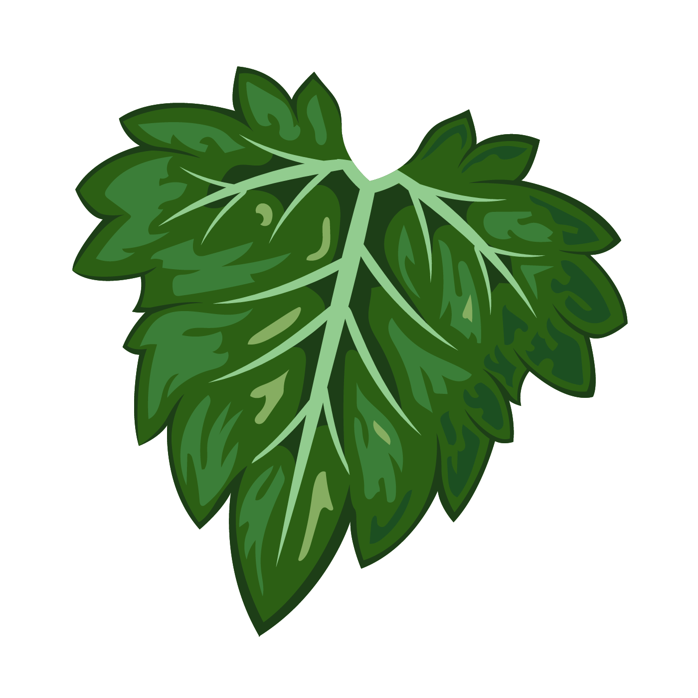

<div align="center">
  
</div>

<div align="center">
  
  
  
  
</div>

# 🎮 Saving Teacher Juan - Versión Web

## 📋 Descripción

Esta es la versión web del juego "Saving Teacher Juan", convertida desde la versión original en Python/Tkinter. El juego mantiene todas las funcionalidades principales:

- ✅ Generación procedural de laberintos
- ✅ 4 niveles de dificultad (Básico, Intermedio, Complejo, Extremo)
- ✅ Sistema de programación de movimientos
- ✅ Saltos sobre obstáculos
- ✅ Cronómetro y ranking
- ✅ Editor de laberintos
- ✅ Guardar/Cargar laberintos personalizados
- ✅ Control por teclado y botones

<div align="right">
  
</div>

## 🎯 Cómo jugar

<div align="center">
  
</div>

### Objetivo
Rescata al profe Juan programando una secuencia de movimientos para llegar desde la posición inicial (esquina superior izquierda) hasta la meta (esquina inferior derecha).

### Controles

**Teclado:**
- `↑` `↓` `←` `→` - Agregar movimientos a la secuencia
- `Espacio` - Agregar un salto

**Botones:**
- Usa los botones de movimiento en el panel derecho
- `▶️ Iniciar` - Ejecutar la secuencia programada
- `🔁 Nuevo` - Generar un nuevo laberinto
- `🗑️ Limpiar` - Borrar la secuencia y reiniciar posición
- `🏆 Ranking` - Ver las mejores puntuaciones

### Elementos del laberinto

- 🧑 **Jugador** - Tu posición actual
- 🎯 **Meta** - Objetivo a alcanzar
- ⬜ **Suelo** - Puedes caminar libremente
- ⬛ **Muro** - No puedes atravesarlo
- 🟥 **Trampa** - Puedes saltarla pero no caminar sobre ella

### Mecánica de salto

El salto te permite pasar sobre una trampa o muro, avanzando 2 casillas en la última dirección que programaste. Por ejemplo:

1. Agrega movimiento `→` (derecha)
2. Agrega `Salto`
3. El jugador saltará 2 casillas a la derecha

<div align="left">
  
</div>

## ✏️ Editor de laberintos

1. Haz clic en `✏️ Editar laberinto`
2. **Clic izquierdo** en una casilla para cambiar su tipo (suelo → muro → trampa → suelo)
3. **Clic derecho** en una casilla para colocar el jugador o la meta
4. Usa `💾 Guardar` para exportar tu laberinto como JSON
5. Usa `📂 Cargar` para importar un laberinto guardado

<div align="right">
  
</div>

## 🏆 Sistema de ranking

- Se guarda automáticamente en el navegador (localStorage)
- Mantiene el top 5 de cada nivel de dificultad
- Ordenado por tiempo (menor es mejor)
- Persiste entre sesiones

## 📁 Archivos del proyecto

```
├── index.html      # Estructura HTML del juego
├── game.css        # Estilos y diseño
├── game.js         # Lógica del juego
└── README_WEB.md   # Este archivo
```

## 🔧 Características técnicas

- **HTML5 Canvas** para renderizado del laberinto
- **Vanilla JavaScript** (sin dependencias externas)
- **CSS3** con diseño responsive
- **LocalStorage** para persistencia de datos
- **Algoritmo de generación de laberintos** basado en DFS recursivo
- **Verificación de resolubilidad** usando BFS

## 🎨 Personalización

Puedes personalizar los colores editando el objeto `COLORS` en `game.js`:

```javascript
const COLORS = {
    floor: '#e0e0e0',    // Color del suelo
    wall: '#333333',     // Color de los muros
    trap: '#ff6b6b',     // Color de las trampas
    goal: '#50fa7b',     // Color de la meta
    player: '#4ecdc4',   // Color del jugador
    visited: '#cccccc'   // Color de casillas visitadas
};
```

## 🐛 Solución de problemas

**El juego no carga:**
- Asegúrate de que los 3 archivos (HTML, CSS, JS) estén en la misma carpeta
- Verifica que tu navegador tenga JavaScript habilitado
- Intenta usar un servidor local en lugar de abrir el archivo directamente

**El ranking no se guarda:**
- Verifica que tu navegador permita el uso de localStorage
- Algunos navegadores en modo incógnito no guardan datos

**El laberinto no se genera correctamente:**
- Refresca la página (F5)
- Intenta con un nivel de dificultad diferente

## 🌐 Compatibilidad

Probado y funcional en:
- ✅ Chrome/Edge (versión 90+)
- ✅ Firefox (versión 88+)
- ✅ Safari (versión 14+)
- ✅ Opera (versión 76+)

## 📄 Licencia

Este proyecto es una conversión del juego original "Saving Teacher Juan" de Python a JavaScript/HTML5.

## 🤝 Contribuciones

Si encuentras algún bug o tienes sugerencias de mejora, no dudes en reportarlo.

---

<div align="center">
  
  
  
  
  
  
  
</div>

**¡Diviértete rescatando al profe Juan! 🎉**
